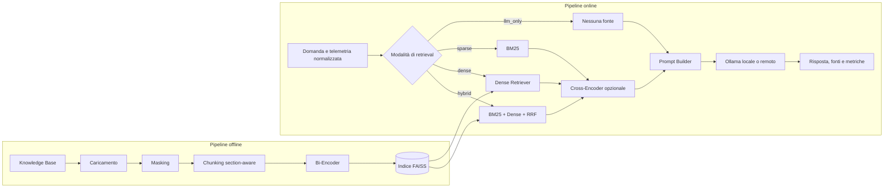

# Progetto di tesi magistrale

## Assistente RAG per il troubleshooting di applicativi basati su microservizi

## Descrizione del problema

Il troubleshooting di applicazioni backend distribuite richiede di correlare informazioni presenti in varie tipologie di documentazione tecnica; testbook, contratti API, log, ticket di segnalazione e incidenti risolti. 
In un'architettura a microservizi, nella quale il componente nel quale un errore diventa visibile può essere diverso da quello in cui il problema ha avuto origine, tale operazione assume una difficoltà ancora maggiore.
Questo progetto si pone come scopo quello di sviluppare e valutare sperimentalmente un assistente basato su Retrieval-Augmented Generation (RAG) che supporti l'analisi degli
incidenti, recuperi conoscenza tecnica pertinente dalla knowledge-base e produca risposte verificabili attraverso le fonti utilizzate. Il sistema nella sua totalità è da intendere come uno strumento volto al fine di supporto alle decisioni e non come un agente di remediation autonoma.
Il caso di studio scelto è OpenTelemetry Demo, utilizzato come applicazione a microservizi dalla quale ricavare scenari di guasto ed evidenze di telemetria riproducibili. La versione fissata per il progetto è **OpenTelemetry Demo 3.1.0**.

## Obiettivi

L'obiettivo principale è confrontare in modo controllato diverse configurazioni di retrieval e misurarne l'efficacia nel troubleshooting tecnico. 
Il progetto prevede:

1. ingestione, normalizzazione e mascheramento dei dati sensibili presenti nella Knowledge-Base;
2. suddivisione deterministica dei documenti in chunk con metadati (batching) e provenienza;
3. retrieval sparso tramite BM25 e retrieval denso tramite bi-encoder;
4. retrieval ibrido con Reciprocal Rank Fusion (RRF);
5. riordinamento dei candidati tramite Cross-Encoder;
6. costruzione di prompt tramite prompt engineering (sfruttando i puntamenti alle fonti del RAG) e generazione tramite un modello servito da Ollama sul computer RAG o su una macchina remota configurabile;
7. valutazione di qualità, faithfulness, retrieval e prestazioni operative.

Il confronto sperimentale principale comprende un baseline LLM senza RAG per poi passare alla valutazione di Sparse RAG, Dense RAG, Hybrid RAG e Hybrid RAG con RRF e reranking.

## Knowledge Base

La Knowledge Base iniziale si trova nella cartella `data/knowledge_base` ed è composta da documenti curati per il perimetro Frontend, Checkout, Cart, Payment e Product Catalog di OpenTelemetry Demo 3.1.0.

I documenti sono suddivisi in:

- descrizione dell'architettura e del flusso della telemetria;
- schede dei servizi selezionati;
- sintesi dei contratti gRPC;
- catalogo degli errori controllati tramite feature flag;
- runbook per il troubleshooting;
- regole per la gestione dei dati sensibili.

La Knowledge Base contiene conoscenza tecnica relativamente stabile: log, tracce e metriche prodotte durante l'esecuzione della Demo rappresentano invece evidenze runtime e non vengono indicizzati indiscriminatamente come documenti statici. Il golden dataset sperimentale è a sua volta separato da entrambi (i dataset di development e test utilizzati per la tesi sono conservati in [`thesis_evidence/dataset`](thesis_evidence/dataset))

La versione di riferimento e le fonti ufficiali utilizzate sono riportate nel documento [`reference-version.md`](data/knowledge_base/architecture/reference-version.md).

## Pipeline del sistema

La pipeline è separata in una fase offline di preparazione della conoscenza e una fase online di analisi delle richieste (inferenza con chiamate REST).

### Pipeline offline

- **Caricamento**: acquisizione controllata di documenti Markdown e testuali.
- **Sensitive Data Detection & Masking**: mascheramento estensibile di PII, credenziali e informazioni infrastrutturali sensibili.
- **Chunking**: creazione di frammenti recuperabili con identificativi stabili e metadati di provenienza. (Section-aware Strategy).
- **Embedding**: trasformazione in batch del testo dei chunk tramite bi-encoder. Implementato.
- **Dense Index**: indicizzazione e persistenza dei vettori e della mappatura dei chunk tramite FAISS. Implementato.
- **Job di indicizzazione**: orchestrazione completa della pipeline offline a partire dalla configurazione eseguibile tramite il comando:

     `python -m app.cli.index_knowledge_base`

### Pipeline online

- **Query processing**: composizione della domanda con evidenze di telemetria già normalizzate, senza indicizzare indiscriminatamente i dati runtime grezzi.
- **Dense Retrieval**: embedding della query e ricerca Top-K nell'indice FAISS. 
- **Sparse Retrieval**: indicizzazione lessicale e ricerca Top-K tramite BM25. 
- **Hybrid Retrieval**: recupero sparse e dense con una graduatoria unificata. 
- **Fusion e reranking**: combinazione tramite RRF e riordinamento opzionale con Cross-Encoder, con misurazione separata delle latenze dei due stadi. Implementato.
- **Prompt assembly**: unione di istruzioni, domanda, contesto dell'incidente, chunk recuperati e identificativi deterministici delle fonti nel formato `[FONTE_n]`.
- **Generazione**: invocazione REST di un LLM servito da Ollama in locale o su una macchina remota della rete privata.
- **Risposta**: restituzione di diagnosi, verifiche suggerite, citazioni strutturate e metriche operative. Ogni citazione conserva documento, chunk, sezione, rank, retriever e punteggi disponibili; le metriche distinguono retrieval, reranking, costruzione del prompt, generazione e tempo totale.

## Struttura del progetto

```
|-- app/
|   |-- api/                 # Schemi REST, normalizzazione del contesto e factory FastAPI
|   |-- bootstrap/           # Assemblaggio esplicito della pipeline offline e online
|   |-- cli/                 # Comandi per indicizzazione ed esperimenti
|   |-- config/              # Caricamento e validazione della configurazione
|   |-- generation/          # Prompt builder, interfaccia LLM e client Ollama
|   |-- indexing/
|   |   |-- embeddings/      # Astrazione e implementazione Sentence Transformers
|   |   |-- sparse/          # Tokenizzazione tecnica e indice BM25
|   |   |-- vector_store/    # Astrazione e indice persistente FAISS
|   |-- ingestion/
|   |   |-- chunking/        # Chunking section-aware
|   |   |-- loaders/         # Caricamento dei documenti locali
|   |   |-- masking/         # Mascheramento dei dati sensibili
|   |-- evaluation/          # Golden case e metriche Recall@K e MRR
|   |-- models/              # Modelli di dominio
|   |-- retrieval/           # Retriever Dense, Sparse e Hybrid con fusione RRF
|   |-- services/            # Orchestrazione del flusso RAG
|   |-- main.py              # Entry point del server FastAPI
|-- configs/
|   |-- application.yaml     # Configurazione applicativa progressiva
|   |-- experiments/         # Configurazioni LLM-only, Dense, Sparse, Hybrid e Hybrid con reranking
|-- contracts/
|   |-- openapi/
|       |-- troubleshooting-api.yaml
|-- data/
|   |-- golden_dataset/      # Casi di troubleshooting per la valutazione
|   |-- knowledge_base/      # Corpus documentale OpenTelemetry Demo 3.1.0
|-- tests/                   # Test unitari, contrattuali e di integrazione
|-- thesis_evidence/
|   |-- configurazione/      # Modelfile e configurazioni generali
|   |-- dataset/             # Development, test e catalogo dei casi
|   |-- input/               # Dati registrati per il ricalcolo delle metriche della campagna pilota
|   |-- figure/              # Grafici e metriche calcolate
|   |-- tabelle/             # Tabelle delle metriche calcolate in formato CSV
|   |-- validazione_umana/   # Schede Excel di revisione dei casi e valutazione delle risposte fornite dal sistema RAG in tutte le cinque configurazioni disponibili
|   |-- startup_scripts/     # Script PowerShell per l'avvio dell'applicativo in tutte le  configurazioni possibili
|   |-- metrics.py           # Script per il ricalcolo delle metriche e generazione di tabelle e figure
|-- .env.example             # Variabili di ambiente di esempio
|-- pyproject.toml           # Dipendenze e configurazione degli strumenti Python
```

## Configurazione

La configurazione di base è descritta in `configs/application.yaml`, mentre i valori dipendenti dall'ambiente sono dichiarati in `.env.example`.

Per creare la configurazione locale su Windows PowerShell:

```powershell
Copy-Item .env.example .env
```

Occorre poi valorizzare almeno:

- `OLLAMA_BASE_URL`, con l'indirizzo della macchina che ospita Ollama;
- `OLLAMA_MODEL`, con il nome del modello disponibile nel servizio Ollama configurato;
- `EMBEDDING_MODEL`, con il modello Sentence Transformers scelto;
- `KNOWLEDGE_BASE_PATH`, con il percorso della Knowledge Base;
- `KNOWLEDGE_BASE_VERSION`, con la versione logica del corpus usato;
- `VECTOR_STORE_PATH`, con il percorso in cui salvare l'indice FAISS;
- `RETRIEVAL_MODE`, con una modalità tra `llm_only`, `dense`, `sparse` e `hybrid`;
- `RETRIEVAL_TOP_K`, con il numero massimo di risultati da recuperare;
- `RERANKER_MODEL`, con il modello Cross-Encoder utilizzato per il secondo stadio;
- `RERANKER_ENABLED`, per abilitare il reranking nell'esecuzione dell'API;
- `RERANKER_BATCH_SIZE`, con il numero di coppie query-chunk valutate per batch;
- `RERANKER_CANDIDATE_TOP_N`, con il numero di candidati RRF inviati al Cross-Encoder;
- `GOLDEN_DATASET_PATH`, con il percorso del dataset sperimentale;
- `EXPERIMENT_RESULTS_PATH`, con la directory in cui salvare i risultati.

## Installazione dell'ambiente

Il progetto richiede Python 3.11 o una versione successiva.

```powershell
py -3.11 -m venv .venv
.\.venv\Scripts\Activate.ps1
python -m pip install --upgrade pip
python -m pip install -e ".[dev]"
```

## Come eseguire il progetto

L'esecuzione completa è composta da una fase offline, da eseguire quando cambia la Knowledge Base o il modello di embedding, e da una fase online che espone l'API REST.

### 1. Preparazione della configurazione

Creare il file locale `.env` e sostituire tutti i segnaposto racchiusi tra parentesi angolari:

```powershell
Copy-Item .env.example .env
```

La configurazione sperimentale usa `intfloat/multilingual-e5-base` per gli embedding normalizzati. In `configs/application.yaml` sono impostati i prefissi `query: ` per le richieste e `passage: ` per i documenti. Il nome configurato in `EMBEDDING_MODEL` e i prefissi devono essere coerenti tra costruzione dell'indice e avvio dell'API 
NOTA: l'impiego di un altro modello richiede di adeguare anche queste impostazioni.

Il file `.env` non viene versionato. Le variabili già definite nel processo hanno precedenza sui valori letti dal file, così una pipeline automatizzata può sostituire la configurazione locale senza modificare il repository.

### 2. Configurazione del servizio Ollama

Per utilizzare Ollama sullo stesso computer dell'applicazione, impostare `OLLAMA_BASE_URL=http://127.0.0.1:11434`. Il modello della campagna sperimentale è `rag-thesis-ministral-fixed:v4`, derivato da `ministral-3:8b` con temperatura `0`, seed `42`, contesto di `4096` token e limite di generazione di `3072` token. Con Ollama in esecuzione, può essere creato dalla radice del repository:

```powershell
ollama pull ministral-3:8b
ollama create rag-thesis-ministral-fixed:v4 -f thesis_evidence/configurazione/Modelfile.ministral-v4
```

Impostare quindi `OLLAMA_MODEL=rag-thesis-ministral-fixed:v4` in `.env`. 

### Caso di configurazione su macchina remota

Per l'esecuzione su una macchina remota seguire invece i passaggi riportati di seguito.

Il computer che esegue Ollama deve soltanto ospitare il modello generativo: non deve contenere una copia di questo repository né della Knowledge Base. L'indicizzazione, il retrieval e la costruzione del prompt vengono eseguiti sul computer RAG; a Ollama viene inviato via HTTP soltanto il prompt già composto.

Sul computer Ollama:

1. scaricare il modello scelto con `ollama pull <OLLAMA_MODEL_NAME>`;
2. configurare `OLLAMA_HOST=0.0.0.0:11434` e riavviare Ollama;
3. consentire la porta `11434` nel firewall esclusivamente per la rete privata necessaria.

Sul computer RAG impostare in `.env`:

```text
OLLAMA_BASE_URL=http://<IP_PRIVATO_PC_OLLAMA>:11434
OLLAMA_MODEL=<OLLAMA_MODEL_NAME>
```

Verificare la raggiungibilità prima di avviare l'applicazione:

```powershell
Invoke-RestMethod -Method Get -Uri "http://<IP_PRIVATO_PC_OLLAMA>:11434/api/tags"
```

Le modalità di esposizione del servizio sono descritte nella [FAQ ufficiale di Ollama](https://docs.ollama.com/faq#how-can-i-expose-ollama-on-my-network).

### 3. Costruzione dell'indice denso

Eseguire il job offline dalla radice del repository:

```powershell
python -m app.cli.index_knowledge_base
```

Il comando:

1. carica i documenti Markdown e testuali;
2. maschera i dati sensibili censiti;
3. applica il chunking section-aware;
4. calcola gli embedding in batch;
5. salva l'indice FAISS e la mappatura dei chunk in `VECTOR_STORE_PATH`.

Al primo utilizzo Sentence Transformers può dover scaricare il modello configurato. L'indice deve essere ricostruito quando cambiano la Knowledge Base, i parametri di chunking, il modello di embedding o i relativi prefissi.

### 4. Avvio dell'API

Selezionare in `.env` una modalità tra `llm_only`, `sparse`, `dense` e `hybrid`, quindi avviare il server:

```powershell
python -m app.main
```

Host e porta sono letti da `SERVER_HOST` e `SERVER_PORT`. Con i valori di esempio la documentazione interattiva è disponibile all'indirizzo `http://localhost:8000/docs`.

Esempio di richiesta da una seconda console PowerShell:

```powershell
    $body = @{
        question = "Perché il checkout non completa il pagamento?"
        incident_context = "La chiamata payment/charge restituisce connection refused."
        service = "checkout"
    } | ConvertTo-Json

    Invoke-RestMethod `
        -Method Post `
        -Uri "http://localhost:8000/troubleshoot" `
        -ContentType "application/json" `
        -Body $body
```

Le modalità `dense` e `hybrid` richiedono un indice FAISS già costruito. `sparse` costruisce BM25 in memoria a partire dalla Knowledge Base, mentre `llm_only` non esegue retrieval. Impostando `RERANKER_ENABLED=true`, il retriever selezionato viene seguito dal Cross-Encoder configurato; per il confronto sperimentale previsto il reranking viene applicato alla modalità ibrida.

### 5. Avvio delle configurazioni per le prove manuali

La cartella [`thesis_evidence/startup_scripts`](thesis_evidence/startup_scripts) contiene gli script Windows PowerShell per avviare i servizi e selezionare una configurazione.
Prerequisiti:
 1) ambiente `.venv`;
 2) file `.env` compilato;
 3) Docker Desktop;
 4) Ollama;
 5) Repository di OpenTelemetry Demo 3.1.0 clonato;

NOTA: Le modalità E2 ed E3 richiedono inoltre l'indice in `data/vector_store`.

Dalla radice del repository avviare prima i servizi:

```powershell
.\thesis_evidence\startup_scripts\00_avvia_servizi.ps1
```

Lo script usa per la Demo il percorso predefinito `C:\Projects\opentelemetry-demo`, sostituibile tramite il parametro `-DemoPath`, si occupa del controllo della revisione del checkout, avviare Docker Desktop, lo stack della Demo e Ollama e creare il modello fisso se assente.

In una seconda console avviare **uno solo** dei seguenti script:

```powershell
.\thesis_evidence\startup_scripts\01_avvia_E0_llm_only.ps1
.\thesis_evidence\startup_scripts\02_avvia_E1_bm25.ps1
.\thesis_evidence\startup_scripts\03_avvia_E2_dense.ps1
.\thesis_evidence\startup_scripts\04_avvia_E3_hybrid.ps1
.\thesis_evidence\startup_scripts\05_avvia_E4_hybrid_rerank.ps1
```

Per cambiare configurazione arrestare l'applicazione con `Ctrl+C`. Gli script usano Ollama locale e rendono l'API disponibile sulle interfacce di rete alla porta `8000`; dagli altri dispositivi occorre utilizzare l'indirizzo IPv4 della scheda Wi-Fi o Ethernet del computer RAG. Le istruzioni per il firewall e un esempio di chiamata `curl.exe` sono riportati in [`ISTRUZIONI.txt`](thesis_evidence/startup_scripts/ISTRUZIONI.txt).

## Architettura eseguibile



Lo schema completo modificabile è disponibile nella cartella [`architecture_schema`](architecture_schema).

## Output del sistema

Il contratto e l'adapter FastAPI definiscono il seguente endpoint REST:

- **POST `/troubleshoot`**: riceve una domanda, un eventuale servizio interessato e un contesto di incidente composto da testo, log, span e metriche normalizzate; restituisce una risposta grounded, le fonti utilizzate, le latenze dei singoli stadi e l'utilizzo dei token comunicato da Ollama quando disponibile.

La specifica completa si trova in [`troubleshooting-api.yaml`](contracts/openapi/troubleshooting-api.yaml).

## Testing

Per eseguire tutti i test:
```powershell
python -m pytest -q
```
La suite attuale comprende test automatici per contratti, componenti applicativi e metriche sperimentali.

## Valutazione sperimentale

Il confronto comprende cinque configurazioni:

| Configurazione | Modalità | Reranking |
| --- | --- | --- |
| E0 | LLM-only, senza retrieval | Disabilitato |
| E1 | Sparse RAG con BM25 | Disabilitato |
| E2 | Dense RAG con FAISS | Disabilitato |
| E3 | Hybrid RAG con BM25, FAISS e RRF | Disabilitato |
| E4 | Hybrid RAG con BM25, FAISS e RRF | Cross-Encoder |

Il dataset conservato in `thesis_evidence/dataset` comprende **10 casi di development e 50 casi di test**. La campagna pilota è stata eseguita sui casi di development, il test successivo comprende 250 risposte ciascuna delle quali composta da una coppia caso-configurazione.
La revisione dei casi e la valutazione delle risposte sono state completate da **un valutatore** che si è occupato del controllo, correggendo e validando le varie chiamate effettuate.

### Esecuzione di nuovi esperimenti

Il modulo `app/evaluation` carica i golden case e le configurazioni YAML presenti in `configs/experiments`, il runner interroga lo stesso sistema RAG per ogni caso, calcola Recall@K e Mean Reciprocal Rank e conserva anche risposta generata, fonti e latenza.
Ogni esecuzione viene salvata in una cartella identificata da timestamp e configurazione:

```
results/<run_id>/
    |-- config.yaml
    |-- metrics.json
    |-- cases.jsonl
    |-- summary.md
```

Prima degli esperimenti Dense, Hybrid e Hybrid con reranking deve essere disponibile l'indice costruito con il comando di indicizzazione. Ollama deve essere raggiungibile per tutte le configurazioni, compreso il baseline LLM-only.

Il dataset da usare è selezionato con `GOLDEN_DATASET_PATH`: il valore di esempio in `.env.example` punta a `data/golden_dataset/cases.jsonl`. Per eseguire il test conservato tra le evidenze della tesi, impostare nella console:

```powershell
$env:GOLDEN_DATASET_PATH = "thesis_evidence/dataset/test.jsonl"
```

Per il development usare invece `thesis_evidence/dataset/development.jsonl`. I comandi seguenti avviano nuove generazioni; i risultati vanno conservati separatamente da quelli già utilizzati nella tesi e richiedono una propria valutazione delle risposte.

Per eseguire una singola configurazione:

```powershell
python -m app.cli.run_experiment --experiment-config configs/experiments/dense.yaml
```

Per eseguire l'intero confronto, lanciare in sequenza:

```powershell
python -m app.cli.run_experiment --experiment-config configs/experiments/llm_only.yaml
python -m app.cli.run_experiment --experiment-config configs/experiments/sparse.yaml
python -m app.cli.run_experiment --experiment-config configs/experiments/dense.yaml
python -m app.cli.run_experiment --experiment-config configs/experiments/hybrid.yaml
python -m app.cli.run_experiment --experiment-config configs/experiments/hybrid_rerank.yaml
```

Ogni esecuzione usa lo stesso golden dataset, prompt builder e generatore, registra il commit Git e gli identificativi dei modelli e salva output per caso, Recall@K, MRR, latenze e token comunicati da Ollama. Le cartelle generate in `results` sono escluse da Git e vanno conservate come artefatti sperimentali quando utilizzate nella tesi.

### Ricalcolo delle evidenze della campagna pilota

Lo script [`metrics.py`](thesis_evidence/metrics.py) legge i dataset e i dati registrati in `thesis_evidence/input`, controlla gli hash previsti dal manifest e ricalcola le metriche senza interrogare Ollama o avviare OpenTelemetry Demo. Produce sette tabelle CSV e dieci figure PNG, stampa le tabelle a video e apre i grafici in finestre interattive.

Con l'ambiente Python attivo, dalla radice del repository:

```powershell
python -m pip install matplotlib
python thesis_evidence/metrics.py
```

## Limitazioni note

- La Knowledge Base è curata e circoscritta ai servizi selezionati di OpenTelemetry Demo 3.1.0.
- Le telemetrie runtime devono essere raccolte e normalizzate prima della chiamata API; non è ancora presente un connettore diretto verso un OTel Collector.
- FAISS usa un indice locale esatto e non offre le funzioni operative di un database vettoriale distribuito.
- BM25 viene ricostruito in memoria all'avvio della relativa modalità e l'indicizzazione densa non è incrementale.
- I modelli Sentence Transformers vengono eseguiti sul computer RAG e possono richiedere il download iniziale dei pesi.
- Il prototipo dipende dalla raggiungibilità del server Ollama e non include autenticazione, TLS o retry di livello produttivo.
- La valutazione umana è stata svolta da un solo valutatore. Il controllo di coerenza delle schede non costituisce una seconda valutazione indipendente.
- I cinquanta casi di test derivano da cinque episodi di guasto: più domande sullo stesso episodio non equivalgono a incidenti indipendenti.
- Query rewriting, HyDE, context compression e faithfulness checker automatico restano estensioni successive al core sperimentale.
- L'Incident Analyzer LSTM/GRU non è implementato: il core funziona senza classificatore e la componente rimane fuori dal flusso eseguibile.

## Prossimi passi

Gli sviluppi successivi riguardano l'estensione degli scenari a nuovi episodi di guasto, la ripetizione delle misure operative e l'integrazione del ricalcolo del test finale e delle valutazioni umane nello script delle metriche. La verifica puntuale delle affermazioni e delle citazioni permetterà di affiancare alle valutazioni complessive delle risposte una misura del loro supporto documentale. Su questa base potranno essere valutate singolarmente le estensioni Advanced RAG rimandate, mantenendo invariati dataset e condizioni di confronto all'interno di ciascuna campagna.

## Documentazione tecnica di riferimento

- [Ollama API](https://docs.ollama.com/api/introduction)
- [Configurazione del server Ollama](https://docs.ollama.com/faq#how-do-i-configure-ollama-server)
- [Sentence Transformers Quickstart](https://www.sbert.net/docs/quickstart.html)
- [FAISS](https://github.com/facebookresearch/faiss)
- [Uvicorn settings](https://www.uvicorn.org/settings/)

## Note sulla logica di commit e git flow

Ogni commit è composto in questo modo:

```
[RAG]: breve messaggio dell'evolutiva
```

In questo modo è possibile mantenere ordine e tracciabilità delle evolutive nel corso del tempo.
Ogni evolutiva viene sviluppata in un branch dedicato che, successivamente al testing, viene integrato nel ramo `develop` e in seguito rilasciato nel ramo `release`, seguendo la logica di Git Flow.

## Autore

 - Cosimo Mariano
